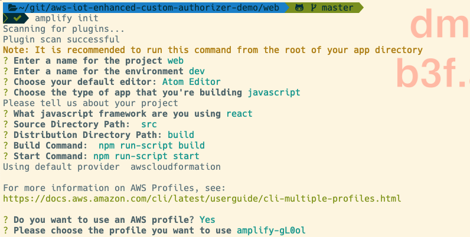

# AWS Amplify SPA Demo

This is a rudimentary sample application built using AWS Amplify which subscribes to MQTT topics using AWS IoT Core Enhanced Custom Authorizers.

## Setup

You have two options to run this demo:
- without an AWS Amplify backend
- with an AWS Amplify backend

This also assumes that you have completed all of the necessary steps to configure your Enhanced Custom Authorizer with AWS IoT Core.

### Option 1 - no AWS Amplify backend
If you want to only test the connection to AWS IoT Core without deploying an Amplify backend, you can run:

```bash
npm install
npm start
```

> NOTE: AWS Amplify libraries requires an `aws-exports.js` file to be present. For this option to work we are providing the file with dummy values.

### Option 2 - with AWS Amplify backend
If you plan to add other AWS Amplify functionalities to this sample app, you should first initialize the backend. You can do this by running:

```bash
npm install
amplify configure # optional if you already have amplify configured with an AWS access key pair
amplify init # example of options to select in screenshot below
npm start
```



> NOTE: If you run this option, a new `aws-exports.js` file will be generated.

## Configuring the app to subscribe to AWS IoT Core

Using the FQDN from your configurable AWS IoT endpoint, you can now build applications using Amplify's PubSub support by passing Tokens through as query string parameters.

This allows you to use any IdP, assuming you correctly validate your tokens within the Custom Authorizer and generate sensible IoT policies with least privileged access (instead of the allow all policy the example in this codebase currently generates!).

The following is example Amplify component built in React, which also exists under [App.js](./src/App.js):

```javascript
import React from 'react';
import Amplify, { PubSub } from 'aws-amplify';
import { MqttOverWSProvider } from "@aws-amplify/pubsub/lib/Providers";

// TODO - you will replace this with your own ATS-specific custom domain endpoint for AWS IoT Core
const mqtt_host = 'xxxxxxxxxxxxxxxxxxxx-ats.iot.us-east-1.amazonaws.com'

Amplify.addPluggable(new MqttOverWSProvider({
  //here you would include your token as the query string parameter use to initialize the connection
  aws_pubsub_endpoint: `wss://${mqtt_host}/mqtt?token=allow`,
}));

function MessageList(props){
  const messages = props.messages
  const listItems = messages.map((data, i) =>
    <li key={i}>{data.client_received_at.toString()} - {data.message}</li>
  )

  return(
    <ul>{listItems}</ul>
  )
}

export default class App extends React.Component {

  constructor(props){
    super(props)
    this.state = {messages:[]}
  }

  componentDidMount(){
    PubSub.subscribe('#').subscribe({
        next: data => {
          data.value.client_received_at = new Date()
          console.log(`Message received: ${JSON.stringify(data.value)}`)
          this.setState(prevState => ({
            messages: [...prevState.messages, data.value]
          }))
        },
        error: error => console.error(error),
        close: () => console.log('Done'),
    })
  }

  render(){
    const messages = this.state.messages

    return (
      <div className="App">
        <MessageList messages={messages} />
      </div>
    )
  }
}
```

## Cleanup

If you do not plan on using this amplify project, execute the following command to cleanup both the AWS Cloud resources generated by Amplify, as well as local Amplify resource files:

```bash
amplify delete
```
